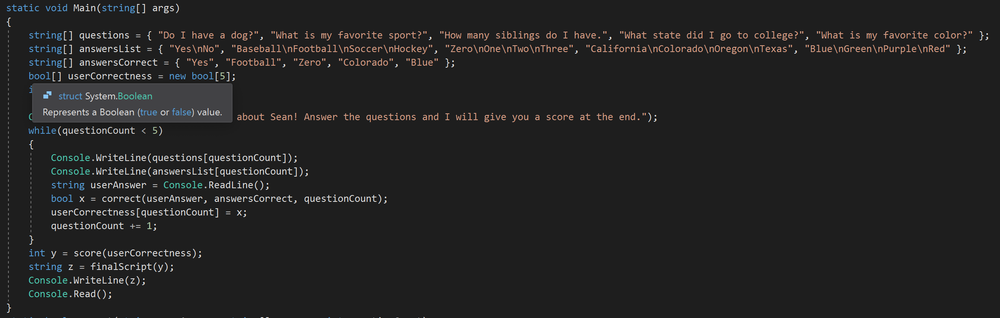

# Lab01-AboutMeQuiz
C# Console Application that prompt a user to take a quiz about me, Sean! Uses a try/catch block for the bool check method.

## Purpose
The purpose of the program is to practice implementing methods in C# while also being able to handle exceptions and errors that occur when instantiating these methods.

## How to run
This code runs and operates through the .sln file. Once The program runs the console will prompt the user to play the game.

## How it works

The game begins at question one and prompts the user to type in the answer. After each answer is given by the user, the program saves the input and passes it into a bool check method. The answer is then stored into an array. Once the array is full the program calls the score method and finally passes that score off to the print method, where the user will find out what they scored!

